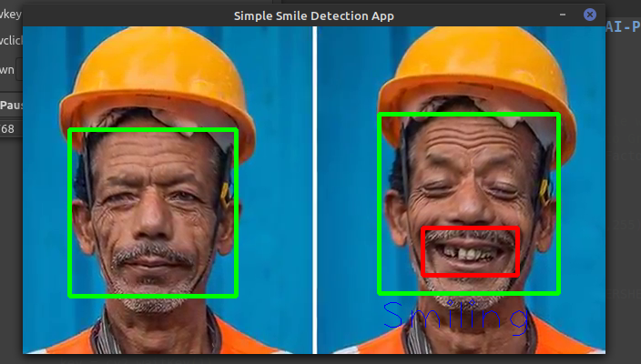

# Simple Smile Detection Application Using Open-CV & HaarCascade Pre-trained Data.

## Before Image :

  

# Some Important Links :

1) https://github.com/opencv/opencv/blob/master/data/haarcascades/haarcascade_frontalface_default.xml